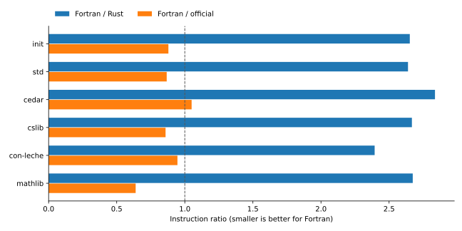

# Instruction-count measurements

This is the **pre-optimization baseline**, preserved with its original source and binary
identities. The current implementation is measured in the [optimization report](optimization-report.md).

All 200 streams have the correct Fortran verdict: 127 accepts, 73 rejects, zero declines. All 26 counters match the pinned Rust kernel for every Init declaration; see [counter evidence](init-fidelity.json.gz).

Each cell is one run using `perf stat -e instructions:u`. The main table uses four Fortran and Rust workers. The official driver replays declarations serially (`LEAN_NUM_THREADS=4` is set). Runs use an unlimited main stack, `OMP_STACKSIZE=1G`, a 3,600-second timeout and a 22,000,000 KiB virtual-memory limit. Wall time is supplementary on this shared AMD EPYC 9455 host. Virtual CPU seconds are instructions divided by 6 billion.

GNU time wraps perf to measure peak RSS. On tiny streams the roughly 18 MiB perf monitor sets a measurement floor; the large-stream peaks belong to the checker.

[Compiler, source, and host identities](measurement-environment.json).

[Reproduction instructions](reproduce.md) · [Export provenance](export-provenance.json) · [Raw measurement logs](measurement-logs.tar.gz)

## Large streams

Ratios above 1 mean that Fortran executes more instructions.

| Stream | Fortran instructions | Rust instructions | Official instructions | Fortran / Rust | Fortran peak GiB |
|---|---:|---:|---:|---:|---:|
| init | 322,754,986,181 | 121,692,660,910 | 366,947,980,278 | 2.652 | 0.953 |
| std | 534,572,405,885 | 202,572,317,057 | 616,535,251,970 | 2.639 | 1.685 |
| cedar | 837,621,580,640 | 295,240,628,365 | 797,735,278,326 | 2.837 | 3.002 |
| cslib | 2,083,651,705,256 | 781,107,470,725 | 2,426,653,047,040 | 2.668 | 6.590 |
| con-leche | 633,440,846,637 | 264,592,639,241 | 669,649,930,995 | 2.394 | 2.452 |
| mathlib | 7,560,453,966,963 | 2,827,610,926,587 | 11,829,827,090,895 | 2.674 | 14.296 |

## Hypotheses fixed before measurement

[Original protocol](measurement-protocol.md).

1. Parity on Init/Std: observed ratios are 2.652 and 2.639; the parity hypothesis is not supported.
2. A win on deep telescopes: Fortran uses fewer instructions on 1/7 selected con-leche/magma streams.
3. No win on Mathlib: observed Fortran/Rust ratio is 2.674.

Deep-stream wins: `good/perf/magma-list-deep-n36.ndjson` (0.702 Fortran/Rust).

## Expr layout ablation

The AoS source is generated from the same Fortran Expr implementation by `scripts/make_expr_aos.py`. Only storage, accessors, and capacity growth change. The rest of the checker and build flags are identical. Its Init declaration counters are checked against the same Rust baseline.

| Stream | SoA instructions | AoS instructions | AoS / SoA | SoA peak GiB | AoS peak GiB | AoS status |
|---|---:|---:|---:|---:|---:|---|
| good/cedar.ndjson | 837,621,580,640 | 813,183,167,832 | 0.971 | 3.002 | 2.918 | accept |
| good/con-leche.ndjson | 633,440,846,637 | 620,362,557,784 | 0.979 | 2.452 | 2.367 | accept |
| good/cslib.ndjson | 2,083,651,705,256 | 1,997,947,857,878 | 0.959 | 6.590 | 7.716 | accept |
| good/init.ndjson | 322,754,986,181 | 313,195,434,600 | 0.970 | 0.953 | 1.023 | accept |
| good/mathlib.ndjson | 7,560,453,966,963 | 7,292,194,173,214 | 0.965 | 14.296 | 16.561 | accept |
| good/perf/magma-list-deep-n21.ndjson | 8,071,594,123 | 7,993,525,785 | 0.990 | 0.435 | 0.435 | accept |
| good/perf/magma-list-deep-n36.ndjson | 98,648,065,686 | 97,874,329,934 | 0.992 | 5.783 | 5.744 | accept |
| good/perf/magma-list-pair-n21.ndjson | 132,504,053,576 | 131,578,902,033 | 0.993 | 10.310 | 10.255 | accept |
| good/perf/magma-list-pair-n7.ndjson | 12,503,616,893 | 12,417,211,279 | 0.993 | 0.784 | 0.794 | accept |
| good/perf/magma-string-n4.ndjson | 17,748,164,549 | 17,284,888,679 | 0.974 | 0.170 | 0.192 | accept |
| good/perf/magma-string-pair-n9.ndjson | 37,062,477,373 | 36,269,981,351 | 0.979 | 1.496 | 1.517 | accept |
| good/std.ndjson | 534,572,405,885 | 520,864,854,556 | 0.974 | 1.685 | 1.947 | accept |

AoS executes fewer instructions on 12/12 successful ablation streams.

Rust/Fortran ratios include differences in compilers, parsing and interner implementation; counter equality supports algorithm fidelity but does not establish a causal effect of layout. The Fortran AoS comparison isolates the Expr storage change.

## Single-thread validation

The final Fortran binary also checks Init, Std, Cedar and CSLib with one worker. Serial mode retains cross-declaration caches; the main table uses four workers.

| Stream | Fortran instructions | Rust instructions | Fortran / Rust | Fortran peak GiB |
|---|---:|---:|---:|---:|
| init | 290,565,049,002 | 102,528,101,042 | 2.834 | 1.457 |
| std | 484,124,895,482 | 166,097,733,109 | 2.915 | 2.475 |
| cedar | 763,148,691,092 | 247,595,295,686 | 3.082 | 3.030 |
| cslib | 1,820,527,131,624 | 630,348,207,010 | 2.888 | 6.589 |

## Every stream

[Machine-readable table](instructions.csv) · [Hashed measurement evidence](measurements.json.gz)

| Stream | Verdict | Fortran instructions | Rust instructions | Official instructions | Fortran / Rust |
|---|---|---:|---:|---:|---:|
| bad/bogus1.ndjson | reject | 6,248,558 | 2,494,974 | 167,668,330 | 2.504 |
| bad/constlevels.ndjson | reject | 7,329,361 | 2,686,489 | 168,987,826 | 2.728 |
| bad/ctor-num-fields.ndjson | reject | 11,087,163 | 5,027,528 | 180,095,474 | 2.205 |
| bad/extra-rec.ndjson | reject | 3,006,572 | 1,267,013 | 162,313,762 | 2.373 |
| bad/k-rec-conv.ndjson | reject | 7,074,055 | 2,732,508 | 169,334,325 | 2.589 |
| bad/large-elim-param.ndjson | reject | 2,975,451 | 2,067,145 | 164,496,114 | 1.439 |
| bad/large-elim-prop-bool.ndjson | reject | 9,251,783 | 3,612,882 | 169,965,274 | 2.561 |
| bad/level-imax-leq.ndjson | reject | 2,940,767 | 2,055,878 | 164,979,261 | 1.430 |
| bad/level-imax-normalization.ndjson | reject | 3,268,214 | 1,879,049 | 165,041,229 | 1.739 |
| bad/nat-rec-k-lie.ndjson | reject | 3,848,397 | 1,892,881 | 165,367,045 | 2.033 |
| bad/nat-rec-rules.ndjson | reject | 3,599,346 | 2,601,871 | 176,842,673 | 1.383 |
| bad/nested-unused-param.ndjson | reject | 26,382,312 | 8,571,252 | 183,790,386 | 3.078 |
| bad/orphan-ctor.ndjson | reject | 1,855,169 | 1,186,025 | 162,314,284 | 1.564 |
| bad/orphan-rec.ndjson | reject | 3,057,993 | 1,196,389 | 162,312,067 | 2.556 |
| bad/perf/refute-cheap-first.ndjson | reject | 9,560,505 | 3,138,550 | 247,773,527 | 3.046 |
| bad/perf/refute-cheap-last.ndjson | reject | 192,953,202 | 124,388,538 | 1,086,774,475 | 1.551 |
| bad/proj-non-structure.ndjson | reject | 3,085,987 | 1,602,940 | 164,435,902 | 1.925 |
| bad/proj-of-imax-prop.ndjson | reject | 8,075,001 | 3,348,255 | 170,407,491 | 2.412 |
| bad/proj-of-prop.ndjson | reject | 2,718,022 | 1,508,262 | 164,372,902 | 1.802 |
| bad/proj-of-stuck-prop.ndjson | reject | 129,635,669 | 40,576,823 | 317,911,372 | 3.195 |
| bad/proj-of-subst-prop.ndjson | reject | 126,478,654 | 40,534,171 | 304,116,884 | 3.120 |
| bad/rec-k-lie.ndjson | reject | 3,195,344 | 1,696,188 | 164,460,189 | 1.884 |
| bad/rec-missing-ih.ndjson | reject | 138,360,742 | 44,255,580 | 315,804,720 | 3.126 |
| bad/rec-of-subst-prop.ndjson | reject | 134,774,721 | 42,335,574 | 312,653,589 | 3.183 |
| bad/tutorial/002_badDef.ndjson | reject | 1,493,783 | 1,034,828 | 162,026,234 | 1.444 |
| bad/tutorial/009_forallSortBad.ndjson | reject | 1,857,571 | 1,120,084 | 162,393,999 | 1.658 |
| bad/tutorial/010_nonTypeType.ndjson | reject | 1,715,328 | 1,074,478 | 162,307,715 | 1.596 |
| bad/tutorial/011_nonTypeAxiom.ndjson | reject | 1,708,455 | 1,073,150 | 162,276,679 | 1.592 |
| bad/tutorial/012_nonPropThm.ndjson | reject | 1,437,304 | 1,076,163 | 161,959,468 | 1.336 |
| bad/tutorial/014_selfProof.ndjson | reject | 1,437,938 | 1,032,272 | 161,961,244 | 1.393 |
| bad/tutorial/019_tut06_bad01.ndjson | reject | 1,415,595 | 1,012,981 | 161,902,472 | 1.397 |
| bad/tutorial/046_inductBadNonSort.ndjson | reject | 1,754,634 | 1,107,100 | 162,649,686 | 1.585 |
| bad/tutorial/047_inductBadNonSort2.ndjson | reject | 1,600,109 | 1,148,118 | 162,215,342 | 1.394 |
| bad/tutorial/048_inductLevelParam.ndjson | reject | 1,435,146 | 1,056,999 | 162,002,840 | 1.358 |
| bad/tutorial/049_inductTooFewParams.ndjson | reject | 1,540,789 | 1,109,101 | 161,978,685 | 1.389 |
| bad/tutorial/050_inductWrongCtorParams.ndjson | reject | 1,826,249 | 1,193,074 | 162,259,705 | 1.531 |
| bad/tutorial/051_inductWrongCtorResParams.ndjson | reject | 1,947,539 | 1,230,206 | 162,311,533 | 1.583 |
| bad/tutorial/052_inductWrongCtorResLevel.ndjson | reject | 1,979,418 | 1,237,499 | 162,350,521 | 1.600 |
| bad/tutorial/053_inductInIndex.ndjson | reject | 1,763,474 | 1,178,794 | 162,234,900 | 1.496 |
| bad/tutorial/054_indNeg.ndjson | reject | 1,595,031 | 1,076,091 | 162,217,399 | 1.482 |
| bad/tutorial/056_reduceCtorType.mk.ndjson | reject | 2,062,991 | 1,200,965 | 162,411,062 | 1.718 |
| bad/tutorial/057_indNegReducible.ndjson | reject | 1,971,125 | 1,139,877 | 162,574,882 | 1.729 |
| bad/tutorial/061_typeWithTooHighTypeField.mk.ndjson | reject | 1,722,313 | 1,159,049 | 162,178,099 | 1.486 |
| bad/tutorial/073_BogusRecursor.ndjson | reject | 2,081,419 | 1,330,602 | 162,588,515 | 1.564 |
| bad/tutorial/087_projOutOfRange.ndjson | reject | 3,261,524 | 1,547,522 | 163,766,656 | 2.108 |
| bad/tutorial/088_projNotStruct.ndjson | reject | 2,864,846 | 1,467,506 | 163,491,450 | 1.952 |
| bad/tutorial/090_projProp2.ndjson | reject | 5,141,083 | 2,221,820 | 165,873,873 | 2.314 |
| bad/tutorial/092_projProp4.ndjson | reject | 5,131,160 | 2,189,769 | 165,930,925 | 2.343 |
| bad/tutorial/093_projProp5.ndjson | reject | 5,435,193 | 2,118,496 | 166,150,873 | 2.566 |
| bad/tutorial/094_projProp6.ndjson | reject | 5,089,636 | 2,122,844 | 165,924,281 | 2.398 |
| bad/tutorial/096_projIndexData.ndjson | reject | 3,987,669 | 1,843,957 | 165,015,515 | 2.163 |
| bad/tutorial/097_projIndexData2.ndjson | reject | 3,978,226 | 1,852,583 | 165,036,614 | 2.147 |
| bad/tutorial/100_ruleKbad.ndjson | reject | 4,918,847 | 1,873,737 | 169,561,841 | 2.625 |
| bad/tutorial/101_ruleKAcc.ndjson | reject | 11,459,878 | 3,185,846 | 175,257,501 | 3.597 |
| bad/tutorial/105_proofIrrelevanceBad.ndjson | reject | 5,658,150 | 1,596,371 | 165,974,479 | 3.544 |
| bad/tutorial/110_indexedUnitEta.ndjson | reject | 4,884,151 | 1,986,126 | 168,079,691 | 2.459 |
| bad/tutorial/112_indexedStructEta.ndjson | reject | 9,867,191 | 2,143,645 | 168,624,072 | 4.603 |
| bad/tutorial/115_funEtaBad.ndjson | reject | 5,933,718 | 1,612,300 | 167,972,187 | 3.680 |
| bad/tutorial/116_etaRuleK.ndjson | reject | 6,921,493 | 1,863,052 | 171,584,750 | 3.715 |
| bad/tutorial/117_etaCtor.ndjson | reject | 7,773,497 | 2,156,705 | 169,302,963 | 3.604 |
| bad/tutorial/118_reflOccLeft.ndjson | reject | 2,886,107 | 1,482,207 | 163,473,690 | 1.947 |
| bad/tutorial/119_reflOccInIndex.ndjson | reject | 5,388,880 | 1,616,052 | 164,454,712 | 3.335 |
| bad/tutorial/126_accRecNoEta.ndjson | reject | 11,589,940 | 3,092,598 | 175,276,319 | 3.748 |
| bad/tutorial/133_dup_defs.ndjson | reject | 1,017,865 | 688,738 | 160,318,963 | 1.478 |
| bad/tutorial/134_dup_ind_def.ndjson | reject | 1,252,363 | 776,971 | 160,706,636 | 1.612 |
| bad/tutorial/135_dup_ctor_def.ndjson | reject | 1,260,550 | 775,251 | 160,710,959 | 1.626 |
| bad/tutorial/136_dup_rec_def.ndjson | reject | 1,278,522 | 778,654 | 160,718,529 | 1.642 |
| bad/tutorial/137_misnamed_rec_user.ndjson | reject | 2,067,303 | 1,361,274 | 162,599,447 | 1.519 |
| bad/tutorial/138_dup_rec_def2.ndjson | reject | 10,819,315 | 1,300,722 | 162,478,683 | 8.318 |
| bad/tutorial/139_dup_ctor_rec.ndjson | reject | 1,245,273 | 767,885 | 160,665,651 | 1.622 |
| bad/tutorial/140_DupConCon.ndjson | reject | 1,367,846 | 792,263 | 160,889,377 | 1.727 |
| bad/tutorial/141_falseFromUnsafe.ndjson | reject | 1,181,125 | 764,561 | 162,299,690 | 1.545 |
| bad/tutorial/142_falseFromPartial.ndjson | reject | 1,181,383 | 764,051 | 162,306,189 | 1.546 |
| good/cedar.ndjson | accept | 837,621,580,640 | 295,240,628,365 | 797,735,278,326 | 2.837 |
| good/con-leche.ndjson | accept | 633,440,846,637 | 264,592,639,241 | 669,649,930,995 | 2.394 |
| good/corner-cases/proof-param-ok.ndjson | accept | 7,432,745 | 1,297,476 | 162,917,321 | 5.729 |
| good/cslib.ndjson | accept | 2,083,651,705,256 | 781,107,470,725 | 2,426,653,047,040 | 2.668 |
| good/init-prelude.ndjson | accept | 1,659,001,050 | 537,878,525 | 2,156,330,907 | 3.084 |
| good/init.ndjson | accept | 322,754,986,181 | 121,692,660,910 | 366,947,980,278 | 2.652 |
| good/level-index-out-of-order.ndjson | accept | 2,096,465 | 848,767 | 161,676,482 | 2.470 |
| good/mathlib.ndjson | accept | 7,560,453,966,963 | 2,827,610,926,587 | 11,829,827,090,895 | 2.674 |
| good/perf/app-lam.ndjson | accept | 395,721,431 | 73,466,996 | 29,184,473,145 | 5.386 |
| good/perf/args-before-unfold.ndjson | accept | 50,919,179 | 13,212,285 | 212,342,738 | 3.854 |
| good/perf/beta-ladder.ndjson | accept | 165,793,445 | 35,909,184 | 10,045,683,309 | 4.617 |
| good/perf/church-numerals.ndjson | accept | 142,512,458 | 36,418,829 | 278,160,705 | 3.913 |
| good/perf/discarded-argument-match.ndjson | accept | 30,627,306 | 12,363,613 | 745,840,738 | 2.477 |
| good/perf/discarded-argument.ndjson | accept | 21,839,735 | 10,442,562 | 986,339,831 | 2.091 |
| good/perf/folded-constant-first.ndjson | accept | 72,578,391 | 19,846,837 | 240,616,775 | 3.657 |
| good/perf/folded-constant-last.ndjson | accept | 72,442,969 | 19,915,983 | 240,619,861 | 3.637 |
| good/perf/fueled-chain.ndjson | accept | 380,498,669 | 127,709,880 | 605,548,733 | 2.979 |
| good/perf/grind-ring-5.ndjson | accept | 11,337,451,061 | 4,084,450,460 | 12,904,366,692 | 2.776 |
| good/perf/identical-nesting.ndjson | accept | 5,021,874 | 1,854,595 | 165,641,165 | 2.708 |
| good/perf/irrelevance-before-evaluation.ndjson | accept | 8,038,222 | 2,473,230 | 169,691,367 | 3.250 |
| good/perf/let-ladder.ndjson | accept | 148,466,303 | 30,845,139 | 6,074,624,680 | 4.813 |
| good/perf/magma-list-deep-n21.ndjson | accept | 8,071,594,123 | 3,632,753,351 | 13,545,636,102 | 2.222 |
| good/perf/magma-list-deep-n36.ndjson | accept | 98,648,065,686 | 140,525,769,802 | 175,148,071,754 | 0.702 |
| good/perf/magma-list-pair-n21.ndjson | accept | 132,504,053,576 | 86,729,867,804 | 102,609,045,733 | 1.528 |
| good/perf/magma-list-pair-n7.ndjson | accept | 12,503,616,893 | 4,331,508,551 | 9,266,968,282 | 2.887 |
| good/perf/magma-string-n4.ndjson | accept | 17,748,164,549 | 6,579,232,560 | 20,861,137,786 | 2.698 |
| good/perf/magma-string-pair-n9.ndjson | accept | 37,062,477,373 | 14,775,013,246 | 45,734,877,850 | 2.508 |
| good/perf/repeated-subproblem.ndjson | accept | 8,495,286 | 3,207,944 | 167,841,529 | 2.648 |
| good/perf/shared-subterm.ndjson | accept | 150,913,549 | 49,382,663 | 343,305,853 | 3.056 |
| good/perf/shift-cascade.ndjson | accept | 91,373,213 | 25,631,161 | 272,221,533 | 3.565 |
| good/perf/unroll-versus-evaluate.ndjson | accept | 68,931,566 | 19,210,762 | 182,583,472 | 3.588 |
| good/proof-irrel.ndjson | accept | 1,985,893 | 997,298 | 162,338,786 | 1.991 |
| good/sparse-name-index.ndjson | accept | 1,364,514 | 849,829 | 161,664,435 | 1.606 |
| good/std.ndjson | accept | 534,572,405,885 | 202,572,317,057 | 616,535,251,970 | 2.639 |
| good/tutorial/001_basicDef.ndjson | accept | 1,379,236 | 845,162 | 161,693,684 | 1.632 |
| good/tutorial/003_arrowType.ndjson | accept | 1,500,632 | 864,583 | 161,785,225 | 1.736 |
| good/tutorial/004_dependentType.ndjson | accept | 1,437,497 | 854,210 | 161,728,621 | 1.683 |
| good/tutorial/005_constType.ndjson | accept | 1,591,475 | 894,372 | 161,880,294 | 1.779 |
| good/tutorial/006_betaReduction.ndjson | accept | 1,778,229 | 921,248 | 162,076,498 | 1.930 |
| good/tutorial/007_betaReduction2.ndjson | accept | 1,842,800 | 927,160 | 162,103,819 | 1.988 |
| good/tutorial/008_forallSortWhnf.ndjson | accept | 1,804,181 | 918,453 | 162,041,139 | 1.964 |
| good/tutorial/013_thmProof.ndjson | accept | 1,849,828 | 944,601 | 162,156,277 | 1.958 |
| good/tutorial/015_levelComp1.ndjson | accept | 1,401,907 | 851,202 | 161,706,983 | 1.647 |
| good/tutorial/016_levelComp2.ndjson | accept | 1,410,006 | 850,543 | 161,714,426 | 1.658 |
| good/tutorial/017_levelComp3.ndjson | accept | 1,441,916 | 853,710 | 161,718,712 | 1.689 |
| good/tutorial/018_levelParams.ndjson | accept | 1,804,032 | 942,135 | 162,110,922 | 1.915 |
| good/tutorial/020_levelComp4.ndjson | accept | 1,448,112 | 849,213 | 161,714,445 | 1.705 |
| good/tutorial/021_levelComp5.ndjson | accept | 1,418,119 | 849,844 | 161,714,712 | 1.669 |
| good/tutorial/022_imax1.ndjson | accept | 1,503,422 | 879,757 | 161,857,760 | 1.709 |
| good/tutorial/023_imax2.ndjson | accept | 1,555,600 | 881,031 | 161,868,705 | 1.766 |
| good/tutorial/024_levelMaxComm.ndjson | accept | 1,443,775 | 867,179 | 161,763,629 | 1.665 |
| good/tutorial/025_levelMaxAssoc.ndjson | accept | 1,494,863 | 874,629 | 161,806,630 | 1.709 |
| good/tutorial/026_levelMaxIdem.ndjson | accept | 1,454,996 | 866,682 | 161,729,028 | 1.679 |
| good/tutorial/027_levelMaxAbsorb.ndjson | accept | 1,464,241 | 861,045 | 161,763,687 | 1.701 |
| good/tutorial/028_inferVar.ndjson | accept | 1,523,567 | 873,153 | 161,828,246 | 1.745 |
| good/tutorial/029_defEqLambda.ndjson | accept | 1,735,738 | 935,480 | 162,110,252 | 1.855 |
| good/tutorial/030_peano1.ndjson | accept | 2,745,522 | 1,151,789 | 163,194,811 | 2.384 |
| good/tutorial/031_peano2.ndjson | accept | 3,320,670 | 1,351,051 | 163,764,681 | 2.458 |
| good/tutorial/032_peano3.ndjson | accept | 3,900,199 | 1,602,855 | 164,097,732 | 2.433 |
| good/tutorial/033_letType.ndjson | accept | 1,423,687 | 855,055 | 161,743,082 | 1.665 |
| good/tutorial/034_letTypeDep.ndjson | accept | 1,775,483 | 923,454 | 162,044,176 | 1.923 |
| good/tutorial/035_letRed.ndjson | accept | 1,543,253 | 869,604 | 161,801,678 | 1.775 |
| good/tutorial/036_empty.ndjson | accept | 1,777,047 | 988,636 | 162,046,410 | 1.797 |
| good/tutorial/037_boolType.ndjson | accept | 2,135,273 | 1,115,227 | 162,546,574 | 1.915 |
| good/tutorial/038_twoBool.ndjson | accept | 2,736,855 | 1,351,274 | 163,374,555 | 2.025 |
| good/tutorial/039_andType.ndjson | accept | 2,931,805 | 1,333,808 | 163,081,997 | 2.198 |
| good/tutorial/040_prodType.ndjson | accept | 3,245,017 | 1,440,130 | 163,367,147 | 2.253 |
| good/tutorial/041_pprodType.ndjson | accept | 3,243,675 | 1,416,742 | 163,360,306 | 2.290 |
| good/tutorial/042_pUnitType.ndjson | accept | 2,021,647 | 1,055,557 | 162,330,953 | 1.915 |
| good/tutorial/043_eqType.ndjson | accept | 3,021,004 | 1,375,572 | 163,116,854 | 2.196 |
| good/tutorial/044_natDef.ndjson | accept | 2,756,479 | 1,275,454 | 163,005,703 | 2.161 |
| good/tutorial/045_rbTreeDef.ndjson | accept | 11,475,107 | 3,974,652 | 170,180,127 | 2.887 |
| good/tutorial/055_reduceCtorParam.mk.ndjson | accept | 3,497,726 | 1,454,137 | 163,516,263 | 2.405 |
| good/tutorial/058_predWithTypeField.ndjson | accept | 2,119,108 | 1,081,629 | 162,408,766 | 1.959 |
| good/tutorial/059_typeWithTypeField.ndjson | accept | 2,167,386 | 1,099,320 | 162,449,005 | 1.972 |
| good/tutorial/060_typeWithTypeFieldPoly.ndjson | accept | 2,159,017 | 1,106,720 | 162,506,329 | 1.951 |
| good/tutorial/062_emptyRec.ndjson | accept | 1,844,889 | 1,028,366 | 162,082,057 | 1.794 |
| good/tutorial/063_boolRec.ndjson | accept | 2,420,554 | 1,212,599 | 162,891,849 | 1.996 |
| good/tutorial/064_twoBoolRec.ndjson | accept | 2,970,112 | 1,449,939 | 163,691,062 | 2.048 |
| good/tutorial/065_andRec.ndjson | accept | 3,143,112 | 1,413,890 | 163,169,747 | 2.223 |
| good/tutorial/066_prodRec.ndjson | accept | 3,553,708 | 1,476,370 | 163,531,453 | 2.407 |
| good/tutorial/067_pprodRec.ndjson | accept | 3,558,746 | 1,526,925 | 163,521,098 | 2.331 |
| good/tutorial/068_punitRec.ndjson | accept | 2,203,796 | 1,099,120 | 162,496,619 | 2.005 |
| good/tutorial/069_eqRec.ndjson | accept | 3,238,875 | 1,445,109 | 163,225,804 | 2.241 |
| good/tutorial/070_nRec.ndjson | accept | 2,901,465 | 1,359,494 | 163,063,330 | 2.134 |
| good/tutorial/071_rbTreeRef.ndjson | accept | 12,461,853 | 4,393,446 | 170,782,426 | 2.836 |
| good/tutorial/072_boolPropRec.ndjson | accept | 2,172,707 | 1,157,117 | 162,551,487 | 1.878 |
| good/tutorial/074_existsRec.ndjson | accept | 3,454,662 | 1,507,650 | 163,443,570 | 2.291 |
| good/tutorial/075_typeSingletonRecReduction.ndjson | accept | 4,608,211 | 1,845,373 | 165,176,410 | 2.497 |
| good/tutorial/076_sortElimPropRec.ndjson | accept | 4,013,283 | 1,768,547 | 164,296,820 | 2.269 |
| good/tutorial/077_sortElimProp2Rec.ndjson | accept | 4,553,275 | 1,854,122 | 164,770,335 | 2.456 |
| good/tutorial/078_boolRecEqns.ndjson | accept | 5,918,184 | 2,229,534 | 166,853,661 | 2.654 |
| good/tutorial/079_prodRecEqns.ndjson | accept | 10,578,447 | 2,175,785 | 166,648,993 | 4.862 |
| good/tutorial/080_nRecReduction.ndjson | accept | 7,045,941 | 2,509,146 | 167,819,479 | 2.808 |
| good/tutorial/081_listRecReduction.ndjson | accept | 10,458,602 | 3,477,147 | 170,892,565 | 3.008 |
| good/tutorial/082_RBTree.id_spec.ndjson | accept | 31,567,620 | 9,181,478 | 188,237,471 | 3.438 |
| good/tutorial/083_And.right.ndjson | accept | 3,295,599 | 1,432,820 | 163,608,474 | 2.300 |
| good/tutorial/084_Prod.snd.ndjson | accept | 3,634,939 | 1,561,754 | 163,740,912 | 2.327 |
| good/tutorial/085_PProd.snd.ndjson | accept | 3,441,062 | 1,518,981 | 163,743,371 | 2.265 |
| good/tutorial/086_PSigma.snd.ndjson | accept | 3,898,135 | 1,665,080 | 164,144,742 | 2.341 |
| good/tutorial/089_projProp1.ndjson | accept | 5,009,160 | 2,004,023 | 165,495,607 | 2.500 |
| good/tutorial/091_projProp3.ndjson | accept | 4,982,583 | 1,996,283 | 165,497,388 | 2.496 |
| good/tutorial/095_projDataIndexRec.ndjson | accept | 4,032,766 | 1,748,407 | 164,605,858 | 2.307 |
| good/tutorial/098_projRed.ndjson | accept | 5,673,367 | 2,213,948 | 166,317,163 | 2.563 |
| good/tutorial/099_ruleK.ndjson | accept | 4,114,300 | 1,737,696 | 164,668,827 | 2.368 |
| good/tutorial/102_aNatLit.ndjson | accept | 2,634,070 | 1,265,174 | 162,909,379 | 2.082 |
| good/tutorial/103_natLitEq.ndjson | accept | 4,206,903 | 1,764,334 | 164,474,767 | 2.384 |
| good/tutorial/104_proofIrrelevance.ndjson | accept | 3,516,689 | 1,453,815 | 163,883,667 | 2.419 |
| good/tutorial/106_proofIrrelevanceWhnf.ndjson | accept | 3,840,764 | 1,524,103 | 164,150,677 | 2.520 |
| good/tutorial/107_unitEta1.ndjson | accept | 3,888,706 | 1,548,848 | 164,429,631 | 2.511 |
| good/tutorial/108_unitEta2.ndjson | accept | 3,937,620 | 1,591,118 | 164,307,869 | 2.475 |
| good/tutorial/109_unitEta3.ndjson | accept | 3,948,680 | 1,620,132 | 164,333,222 | 2.437 |
| good/tutorial/111_structEta.ndjson | accept | 7,151,150 | 2,632,945 | 167,782,156 | 2.716 |
| good/tutorial/113_funEta.ndjson | accept | 3,741,765 | 1,503,340 | 164,081,182 | 2.489 |
| good/tutorial/114_funEtaDep.ndjson | accept | 3,726,910 | 1,493,452 | 164,167,580 | 2.496 |
| good/tutorial/120_reduceCtorParamRefl.mk.ndjson | accept | 3,705,091 | 1,528,534 | 163,727,191 | 2.424 |
| good/tutorial/121_reduceCtorParamRefl2.mk.ndjson | accept | 3,680,628 | 1,530,997 | 163,724,405 | 2.404 |
| good/tutorial/122_rTreeRec.ndjson | accept | 3,679,248 | 1,642,715 | 164,055,274 | 2.240 |
| good/tutorial/123_rtreeRecReduction.ndjson | accept | 5,976,381 | 2,283,560 | 166,662,135 | 2.617 |
| good/tutorial/124_accRecType.ndjson | accept | 6,040,282 | 2,358,618 | 165,497,007 | 2.561 |
| good/tutorial/125_accRecReduction.ndjson | accept | 8,911,068 | 3,180,273 | 168,968,578 | 2.802 |
| good/tutorial/127_quotMkType.ndjson | accept | 4,504,976 | 1,825,855 | 164,296,596 | 2.467 |
| good/tutorial/128_quotIndType.ndjson | accept | 5,001,686 | 1,838,510 | 164,383,556 | 2.721 |
| good/tutorial/129_quotLiftType.ndjson | accept | 4,691,773 | 1,916,006 | 164,398,153 | 2.449 |
| good/tutorial/130_quotSoundType.ndjson | accept | 4,990,587 | 1,992,351 | 164,772,766 | 2.505 |
| good/tutorial/131_quotLiftReduction.ndjson | accept | 5,362,183 | 2,047,301 | 165,381,218 | 2.619 |
| good/tutorial/132_quotIndReduction.ndjson | accept | 5,219,448 | 2,043,646 | 165,280,852 | 2.554 |
